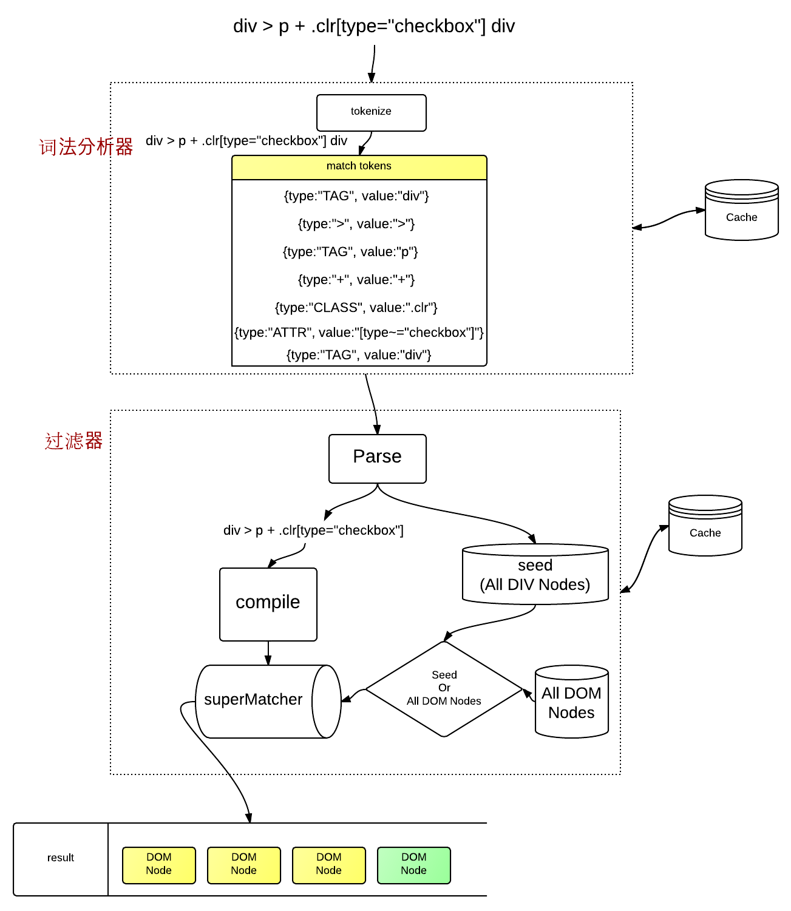

# jQuery内核与详解实践-笔记1

## load与ready事件的区别

>浏览器渲染顺序

>1.解析HTML结构
>
>2.加载样式表和脚本

>3.解析并执行脚本文件

>4.构建DOM HTML模型

>5.加载外部文件图片等

>6.页面渲染加载完成

load事件是原生JS的事件，他发生在页面加载完成的时候，也就是第六步；而且他就有一个特点，他只会执行一次。

```javascript
	window.onload = function(){
		alert(1);
	}
	window.onload = function(){
			alert(2);
		}
	window.onload = function(){
			alert(3);
		}
	//在这里，只会弹出3
```

ready事件是jQuery的事件，他是发生在DOM模型构造完成时，上面所说的第四步，他执行的时间比load事件早，而且他可以执行多次。

```javascript
	$(function(){
		alert(1);	
	})
	$(function(){
			alert(2);	
	})
	$(function(){
			alert(3);	
	})
	//执行时会先别弹出1、2、3
```

load使用并不灵活，但是又不想使用ready方法，可以使用下面的方法
```javascript
	function addLoadEvent(func){
		var oldload = window.onload; //把window.onload事件处理函数的值存入变量oldload
		if(typeof window.onload != 'function'){//如果window.onload事件还没有绑带任何事件处理函数，则为其添加新的事件处理函数
			window.onload = func;
		}else{//如果过window.onload事件已绑带事件处理函数，则重新绑带事件函数，在事件处理函数
		//中先执行原来已绑定的事件处理函数，然后调用新添加的事件处理函数
			window.onload = function(){
				oldload();
				func();
			}
		}
	}
```

ready事件的实现有点麻烦，尤其在IE浏览器上，可以通过readystatechange事件来监控DOM机构是否完成，不过在有图片的情况下，它会出现异常，甚至在load完成后，他也没完成，后面人们想到令一个方法，监控doScroll事件，如果能滑动就证明dom结构完成。
下面是readystatechange的实现：
```javascript
	var $ = ready = window.ready = function(fn){
		if(document.addEventListener){
			document.addEventListener('DomContentLoaded',function(){
				document.removeEventlistener('DOMContentLoaded',arguments.callee,false);//触发DomContentLoaded事件后，立即注销该事件，避免反复触发
				fn();
			},false);
		}else if(document.attachEvent){
			document.attachEvent('onreadystatechange',function(){
				if(document.readyState === 'complete'){
						document.detachEvent('onreadystatechange',arguments.callee);//触发DomContentLoaded事件后，立即注销该事件，避免反复触发
						fn();
					}		
			});
		}
	}
```


## jQuery实例

jQuery实例其实就是一个对象，但他有数组的一些特点，他有索引值还有length属性，但是没有数组的方法，这种实例称为类数组。从本质上来说，jQuery的实例就是DOM对象的集合，DOM对象有序的排列在一起，John resig 重装包装使他成为了jQuery实例

**实例的具体实现**
```javascript
	var $ = jQuery = function(){
		return new jQuery.fn.init(); //如果这里直接new jQuery会进入死循环
	}	
	jQuery.fn = jQuery.prototype = {
		init ： function(){//init作为构造函数产生实例
			return this;
		},
		jQuery : '1.3.1',
		size : function(){
			return this.length;
		}
	}
	jQuery.fn.init.prototype = jQuery.prototype;//改变init原型的指向，使实例可以访问jQuery原型上的方法
```

## jQuery对象特点
1. jQuery对象是一个数据集合，它不是一个个体对象。因此，你无法直接使用Javascript的方法来操作它。
2. jQuery对象实际上就是一个普通的对象，因为它是通过new运算符创建的一个新的实例对象。它可以继承原型方法或者属性，同时也拥有Object类型的方法和属性。
3. jQuery对象包含数组特性，因为它赋值了数组的元素，以数组结构存储返回的数据。
4. jQUery对象包含的数据都是DOM元素，是通过数组形式存储的，即通过jQuery[n]形式获取。同时jQuery对象又定义了几个模仿Array基本特性的属性，如length等。

## jQuery的灵魂--extend

元素选择与操作是jQuery的基础，extend插件扩展是jQuery的灵魂。
extend可以为用户快速扩展jQuery框架，而不伤害他的机构，如果想要删除只要扩展一个空对象就行。
extend的本质就是属性的复制，将指定的对象复制到jQuery对象上。

```javascript
	jQuery.extend = jQuery.fn.extend = function(obj){
		for(var key in obj){
			this[key] = obj[key]
		}
		return this;
	}
```

## jQuery选择器引擎Sizzle
jQuery的默认选择器引擎Sizzle，它的速度号称行业第一，它傲人的速度源于它对特的选择方式

对于$('div p')的选择一般情况是
第一步、根据document.getElementsByTagName()方法选择文档树中的div元素集合。
第二步，迭代div元素集合，在所以的div元素中查找每个div元素下的p元素
第三步，合并结果
而Sizzle选择器适当调整了解析的顺序
第一步，根据document.getElementsByTagName()方法选择文档树中的p元素集合
第二步，迭代p元素集合，在所有的p元素中查找每个p元素的父级元素
第三步，检测父级元素。如果不是div元素，则遍历上一级元素，如果迭代到文档树的顶层，则排除改p元素，如果是div元素，则保存该p元素

Sizzle引擎主要包含一个构造器Sizzle和三个核心功能matches() find() filter() 以及一个表达式对象selectors。

```javascript
	window.Sizzle = function(){
		//主要负责分块和主线流程，通过元素之间关系过滤也被放在这里
	}
	Sizzle.find = function(){
		//查找元素
	}
	Sizzle.filter = function(){
		//过滤元素，主要处理通过元素自身属性过滤
	}
	Sizzle.selectors = {
		//命名空间，以及定义一些变量和特异方法
	}
	var Expr = Sizzle.selectors;
```

Sizzle构造器主要是调用Sizzle.find()函数在DOM文档树中查找与CSS语法相匹配的元素节点集合。jQuery.fn.init()调用了Sizzle()，实际上是调用了Sizzle.find()方法来获取DOM

Sizzle解析流程

构造器接收到表达式后，进行词法分析，调用match得到tokens，跟着通过find()方法得道一堆元素，最后使用filter()方法筛选出对应的元素。

Sizzle在匹配元素时会对ID或者一些属性进行优化处理，正确传入参数可以大大提高性能。下面是jQuery选择器使用规则
1. 多用ID选择器。多用ID选择器，这是一个明智的选择。即使添加“在”ID选择器，也可以从父级元素中添加一个ID选择器，这样就会缩短节点访问的路程。
2. 少用Class选择器。可以使用复合选择器，例如使用tag.class代替.class。文档的标签是有限的，但是类可以拓展标签的语义，那么大部分情况下，使用同一个类的标签也是相同的。
3. 多用父子关系，少用嵌套关系。例如使用parent>child代替parent chlid,因为>是child选择器，只从字节点里匹配，不递归。而后代选择，递归匹配所有字节点及字节点的字节点
4. 缓存jQuery对象。下次调用就不用太调用选择器了。

##jQuery选择器
jQuery选择器借鉴了CSS选择器的选择方式，继承了CSS的语法和使用习惯，成就了它强大的选择功能。

一开始，John regis发现cssQuery的选择器非常灵巧，于是他模仿cssQuery,编写了功能强大、灵活轻巧的jQuery，为我们解决了两大难题
1. 支持CSS1、CSS2、CSS3不同版本的所有选择器。
2. 支持不同类型的主流浏览器，就不用考虑烦人的兼容性问题

**判断jQuery对象是否存在**
jQuery返回的是数组对象，如果没有元素，它是一个空对象。if($('tr'))判断的结果是true，想判断是否有元素，应该用if($('tr').length > 0) 大于零证明有内容，否则就没选中元素


## jQuery选择器类型
1. 简单选择器--ID选择器、标签选择器、类选择器、*选择器 多组选择器（div,p,#wrap）
2. 关系选择次--层级选择器（div > p | p + p | p ~ p）、子元素选择器(:first-child :last-child :only-child :nth-child)
3. 过滤选择器--定位选择器（:first :last :not :event :odd :eq :gt :lt : header :animated） 内容选择器（:container :empty :has :parent）可见选择器（:hidden :visible）
4. 属性选择器
5. 表单选择器--基本表单选择器(:text :input)、高级表单选择器(:enabled :disabled :checked :selected)


